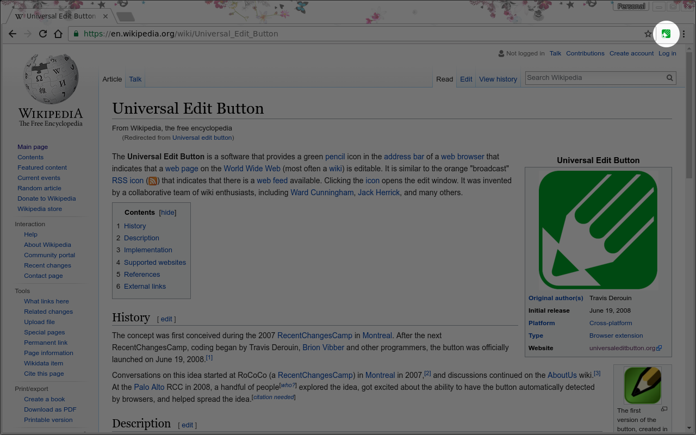

# Universal Edit Button

Using this extension, an  icon will appear in the address bar (Firefox) or Toolbar (Chrome) (similar to the RSS auto-discovery button) when you visit a wiki website that allows you to
edit the page.

This works on popular sites like Wikipedia, AboutUs.com, wikiHow and Wikia and also on most of the major wikis including MediaWiki, DokuWiki, TWiki, PHPWiki, MoinMoin and many more.

This is a web extension compatible with [Chrome](https://chrome.google.com/webstore/detail/universal-edit-button/cemmddlaedjfnndijimmacgkeclafead) and [Firefox](https://addons.mozilla.org/en-US/firefox/addon/universal-edit-button/). It might work in MS Edge as well, but hasn't been tested.

You can learn more about the idea behind this extension at [universaleditbutton.org](http://universaleditbutton.org/)

Note: there is an another Universal Edit Button extension in the Chrome store. It didn't work for me. Your mileage may vary.